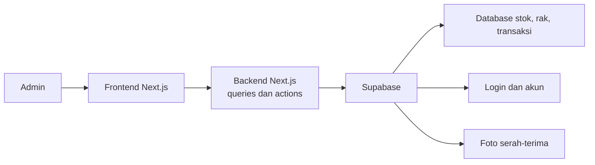

# Arsitektur Ruang Inventaris

Dokumen ini menjelaskan letak kode utama agar proyek mudah dipahami saat dikembangkan.

## Folder utama

| Folder | Isi dan fungsi |
| --- | --- |
| `src/app` | Alamat halaman web, misalnya dashboard, inventory, transaksi, laporan, dan rak. File di sini kecil karena hanya menyusun halaman. |
| `src/features` | Kode berdasarkan fitur bisnis. Setiap folder menyimpan tampilan, pengambilan data, dan perubahan data untuk satu fitur. |
| `src/components/layout` | Header, sidebar, dan kerangka dashboard yang digunakan oleh banyak halaman. |
| `src/components/shared` | Komponen kecil yang dipakai oleh lebih dari satu fitur, misalnya judul halaman dan tampilan data kosong. |
| `src/components/ui` | Komponen tampilan dasar dari shadcn/ui, seperti tombol, input, dialog, dan tabel. Tidak perlu diubah untuk pekerjaan harian. |
| `src/lib/supabase` | Konfigurasi koneksi aplikasi ke Supabase. |
| `supabase/migrations` | Riwayat perubahan struktur database yang dijalankan ke Supabase. |
| `public` | File gambar atau aset yang dapat diakses dari browser. |

## Isi `src/features`

| Folder | Fungsi |
| --- | --- |
| `auth` | Login dan aktivasi akun dari undangan email. |
| `dashboard` | Ringkasan stok dan papan informasi. |
| `inventory` | Daftar barang, pencarian, rak, barang masuk, dan PDF stok. |
| `loans` | Peminjaman, pengembalian, foto serah-terima, serta riwayat transaksi. |
| `racks` | Pengelolaan daftar rak. |
| `reports` | Statistik kegiatan dan unduhan laporan PDF. |
| `users` | Undangan, peran, status, dan penghapusan akun admin. |

## Pola nama file

| Nama file | Fungsi |
| --- | --- |
| `*-page.tsx` | Susunan tampilan utama sebuah fitur. |
| `*-queries.ts` | Membaca data dari Supabase. |
| `*-actions.ts` | Menyimpan atau mengubah data lewat server Next.js. |
| `*-schema.ts` | Aturan validasi data form. |
| `*-types.ts` | Bentuk data yang digunakan oleh fitur tersebut. |

## Folder teknis yang boleh diabaikan

| Folder/file | Keterangan |
| --- | --- |
| `.git` | Riwayat Git dan koneksi ke GitHub. Jangan diubah manual. |
| `node_modules` | Library otomatis dari `npm install`. Jangan diedit manual. |
| `.next-local` | Hasil compile lokal Next.js. Dapat dihapus saat server tidak berjalan. |
| `.env.local` | Konfigurasi dan key Supabase lokal. Jangan diunggah ke GitHub. |
